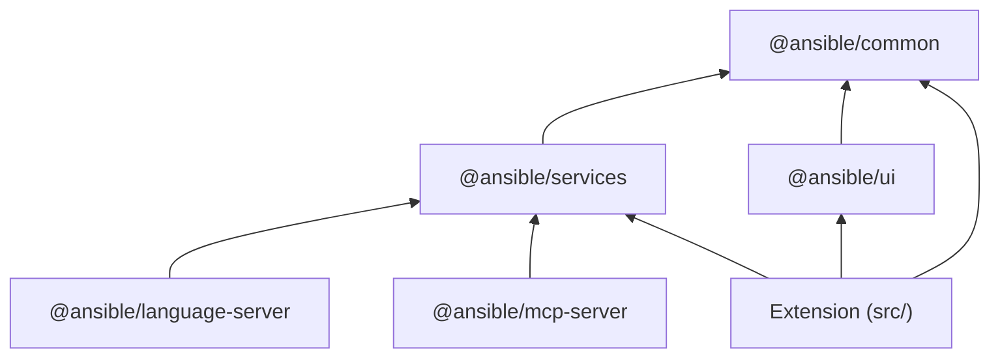

# ADR-011: Package Architecture — @ansible/common and @ansible/services

## Status

Accepted

## Date

2026-06-16

## Context

ADR-001 introduced a monorepo with `@ansible/core` as the VS
Code-independent domain layer. As the codebase grew, `@ansible/core`
accumulated two fundamentally different kinds of code in a single
barrel export:

1. **Browser-safe modules** (types, prompts, pure utility functions,
   parsers) — no Node.js builtins, no filesystem access, no child
   processes. These can run anywhere: Node.js, browsers, webviews,
   web workers.

2. **Node.js services** (collection discovery, command execution,
   container runtime, caching) — depend on `fs`, `path`, `os`,
   `child_process`, `https`. These require a Node.js runtime.

Combining both in one package created a recurring pattern of import
workarounds:

### `typesVersions` hacks for subpath resolution

Webview code needed deep imports (`@ansible/core/prompts/plugin-doc`)
to avoid pulling Node services into the browser bundle. Each such
import required a new `typesVersions` entry in `package.json` — a
mechanism designed for TypeScript version-specific declarations, not
for subpath resolution.

### `paths` workarounds in consumer `tsconfig.json`

`packages/ui/tsconfig.json` mapped `@ansible/core` and its subpaths
directly to source files (`../core/src/...`) because ESLint's type
checker runs before `tsc -b` output exists in CI. This created a
parallel resolution path that diverged from the runtime behavior.

### esbuild aliases coupling to source layout

Three of four bundle targets in `scripts/build.mjs` used
`@ansible/core/out` → `core/src/` aliases to rewrite import paths at
bundle time. The language server imported compiled output directly
(`@ansible/core/out/services/CommandService`), coupling to the build
artifact layout.

### Attempted `exports` field failure

Adding a `package.json` `exports` field (the official Node.js
mechanism for subpath resolution) broke TypeScript's type inference
for barrel imports in the language server, causing hundreds of
`@typescript-eslint/no-unsafe-*` lint failures. The field had to be
reverted.

### Forces

- The webview bundle (browser platform) cannot include Node.js
  builtins — esbuild fails if they leak into the dependency graph.
- All Node.js consumers (extension, language server, MCP server) need
  the same service implementations.
- New browser-safe modules (prompts, types, parsers) should be
  importable without any resolution configuration.
- The build pipeline must remain simple: `tsc -b` for type checking,
  esbuild for bundling (ADR-006).
- Contributors and AI agents must know where new code goes without
  consulting the module resolution configuration.

## Decision

**We will split `@ansible/core` into two packages — `@ansible/common`
(browser-safe foundation) and `@ansible/services` (Node.js service
implementations) — and retire the `@ansible/core` package.**

### Project Architecture

```
packages/
  common/           → @ansible/common    (browser-safe: types, prompts, utils, parsers)
  services/         → @ansible/services  (Node.js: service implementations)
  ui/               → @ansible/ui        (React components, depends on @ansible/common)
  language-server/  → @ansible/language-server (LSP, depends on @ansible/services)
  mcp-server/       → @ansible/mcp-server (MCP tools, depends on @ansible/services)
src/
  extension.ts      → VS Code extension entry point
  panels/           → Webview panel hosts (thin lifecycle management)
  views/            → TreeView providers
  services/         → VS Code-specific services (not shared)
```

### Dependency Graph



All arrows point downward toward `@ansible/common`. No package
depends on `@ansible/ui` except the extension (which bundles it into
the webview). No circular dependencies exist.

### `@ansible/common` — the universal foundation

Contains everything that can run in any JavaScript environment:
browsers, Node.js, Deno, web workers. Zero dependencies on Node.js
builtins or `vscode`.

| Directory | Purpose | Examples |
|-----------|---------|----------|
| `types/` | Shared interfaces and type definitions | `PlaybookConfig`, `PluginData`, `SchemaNode`, `CommandOptions`, `ExecResult` |
| `prompts/` | AI prompt builder functions | `buildTaskAnalysisPrompt`, `buildCollectionsSummaryPrompt` |
| `utils/` | Pure utility functions | `buildCommandArgs`, `SimpleEventEmitter`, `log` |
| `parsers/` | Stateless data transformation | `playbookParser` (`buildPlaybookCommand`, `parsePlaybook`, `mergePlaybookConfig`) |

**Rule**: If a module uses `import` or `require` of `fs`, `path`,
`os`, `child_process`, `https`, `net`, `crypto`, or any other Node.js
builtin, it does not belong in `@ansible/common`.

### `@ansible/services` — the Node.js service layer

Contains stateful services that interact with the operating system,
network, and filesystem. Depends on `@ansible/common` for types and
re-exports them for consumer convenience.

| Module | Responsibility | Key Node.js deps |
|--------|---------------|------------------|
| `CommandService` | Execute external commands, manage bin paths | `child_process`, `fs`, `path` |
| `CollectionsService` | Discover and cache Ansible collections | `fs`, `path` |
| `ContainerRuntime` | Detect engines, run containers, inspect images | `fs`, `os`, `path` |
| `CreatorService` | Drive ansible-creator scaffolding | (dynamic `CommandService`) |
| `DevToolsService` | Discover installed dev tools | `path` |
| `EECache` | Cache execution environment introspection | `fs`, `os`, `path` |
| `EnvironmentCache` | Cache Python environment selections | `fs`, `path` |
| `ExecutionEnvService` | Manage execution environments | `fs`, `path` |
| `GalaxyCollectionCache` | Cache Galaxy collection metadata | `https`, `fs`, `path`, `os` |
| `GitHubCollectionCache` | Cache GitHub-hosted collections | `fs`, `os`, `path` |
| `SkillRegistry` | Discover and manage AI skills | `https`, `fs`, `path`, `os` |

**Rule**: Services use the conditional `require('vscode')` pattern
(ADR-001). An unconditional `import * as vscode from 'vscode'` in any
service file is a violation.

**Rule**: Types consumed by `@ansible/common` modules (e.g.,
`SchemaNode` used by `creatorArgs`) must live in `@ansible/common`,
not alongside the service implementation.

### Naming Rationale

| Package | Name | Why |
|---------|------|-----|
| Browser-safe foundation | `@ansible/common` | Standard monorepo convention for shared code; immediately communicates "safe to import anywhere" |
| Node.js implementations | `@ansible/services` | Describes what it contains; the word "service" already implies runtime infrastructure and stateful operations |
| Pure parsing (in common) | `parsers/playbookParser` | Avoids confusion with `@ansible/services`; "parser" communicates stateless data transformation |

## Guidance for New Code

When adding new functionality, use this decision tree:

```
Is it a type definition or interface?
  → @ansible/common/types/

Is it a pure function (string → string, data → data, no I/O)?
  → @ansible/common/utils/ or @ansible/common/parsers/

Is it an AI prompt template?
  → @ansible/common/prompts/

Does it need fs, path, os, child_process, https, or network I/O?
  → @ansible/services/

Is it a React component rendering domain content?
  → @ansible/ui/

Is it VS Code-specific (TreeView, webview lifecycle, commands)?
  → src/ (extension)
```

### Import Conventions

| Consumer | Import from | Never import from |
|----------|-------------|-------------------|
| Webview / `@ansible/ui` | `@ansible/common` | `@ansible/services` (would pull Node.js) |
| Extension (`src/`) | `@ansible/common`, `@ansible/services` | `@ansible/core` (retired) |
| Language server | `@ansible/services` | `@ansible/core/out/...` (removed) |
| MCP server | `@ansible/services` | `@ansible/core/out/...` (removed) |
| Tests | Package under test + `@ansible/common` for types | — |

`@ansible/services` re-exports all public types from
`@ansible/common`. Node.js consumers that only need one import can
use `@ansible/services` for both services and types.

### Build and Resolution

After the split, no resolution workarounds are needed:

- **No `typesVersions`** — each package has one barrel entry point
- **No `paths` mappings** — consumers import packages by name; npm
  workspace resolution handles the rest
- **No esbuild aliases for `@ansible/core`** — retired package, no
  aliases to maintain
- **Webview bundle** uses `@ansible/common` directly (browser-safe
  barrel); esbuild alias `@ansible/common` → `packages/common/src/`
  for source bundling

## Alternatives Considered

### Alternative 1: Keep one package with `exports` subpaths

**Description**: Add a `package.json` `exports` field to
`@ansible/core` to formally declare browser-safe subpaths
(`@ansible/core/prompts`, `@ansible/core/types`) alongside the full
barrel.

**Pros**:
- No new packages; fewer workspace entries
- Standard Node.js mechanism

**Cons**:
- Already attempted and reverted — broke TypeScript type inference
  for barrel imports in the language server (hundreds of lint errors)
- Barrel import still pulls the full graph unless consumers are
  disciplined about subpath usage
- esbuild does not respect `exports` conditions in all configurations
- Contributors must remember which subpaths are safe vs unsafe

**Why not chosen**: Empirically broken in our toolchain combination
(TypeScript 5.x + `moduleResolution: "node10"` + ESLint typed linting).
Even if fixed, the discipline problem remains — a single barrel import
from `@ansible/core` in a webview file silently breaks the build.

### Alternative 2: Dual entry points (browser + node conditions)

**Description**: Use conditional `exports` with `"browser"` and
`"node"` conditions to serve different barrel contents depending on
the platform.

**Pros**:
- Single package name for all consumers
- Bundlers (webpack, esbuild) support conditions

**Cons**:
- TypeScript does not natively resolve condition-based exports in
  `moduleResolution: "node10"` (our extension and LS setting)
- Requires maintaining two barrel files that must stay synchronized
- Confusing developer experience (same import resolves to different
  code depending on context)
- Difficult to enforce at lint time

**Why not chosen**: TypeScript tooling support is insufficient for our
module resolution settings, and the "magic resolution" behavior
confuses contributors and AI agents.

### Alternative 3: Keep `@ansible/core` name for the browser-safe package

**Description**: Rename the package contents but keep the `@ansible/core`
name for the browser-safe portion; create `@ansible/core-node` for
services.

**Pros**:
- Less migration churn for types/prompts consumers (keep same import)

**Cons**:
- `core` does not communicate "browser-safe" — new contributors
  importing `@ansible/core` in a webview would not realize it is
  intentionally limited
- `core-node` is generic and does not describe what it contains
- Existing imports of services from `@ansible/core` break with no
  clear indication of where they moved

**Why not chosen**: Fresh names (`common` / `services`) make the
architecture self-documenting. The migration is a one-time cost.

## Consequences

### Positive

- **Zero resolution hacks**: No `typesVersions`, no `paths`
  workarounds, no esbuild aliases for cross-package resolution.
  Standard npm workspace resolution works everywhere.
- **Self-documenting architecture**: Package names communicate their
  contract. `@ansible/common` is safe everywhere; `@ansible/services`
  requires Node.js. New contributors and AI agents know immediately
  where code belongs.
- **Webview safety guaranteed structurally**: It is impossible to
  accidentally import Node.js code into a webview — the webview only
  depends on `@ansible/common` and `@ansible/ui`, neither of which
  can contain Node.js builtins.
- **Language server cleanup**: The `@ansible/core/out/services/...`
  anti-pattern (coupling to build artifacts) is replaced by a standard
  barrel import from `@ansible/services`.
- **Simpler build pipeline**: esbuild configuration drops 6 alias
  entries across 4 targets.
- **Future-proof**: New browser-safe modules are added to
  `@ansible/common` without any configuration changes. New Node.js
  services go to `@ansible/services`. No ad-hoc `typesVersions`
  entries needed.

### Negative

- **One-time migration cost**: All existing imports from
  `@ansible/core` must be rewritten across the extension, language
  server, and MCP server.
- **Two packages to maintain**: Two `package.json` files, two
  `tsconfig.json` files, two sets of tests. (Mitigated by the
  packages being cleanly separated with no shared build concerns.)
- **Re-export convenience layer**: `@ansible/services` re-exporting
  `@ansible/common` types adds a small maintenance surface. If a type
  is removed from `@ansible/common`, the re-export must also be
  removed.

### Neutral

- `@ansible/ui` already depends on types/prompts from common — after
  the split it imports from `@ansible/common` instead of deep paths
  into `@ansible/core`. The dependency direction is unchanged.
- The extension can import from both packages. Most files will use
  `@ansible/services` for convenience (since it re-exports common
  types), with `@ansible/common` used only when a module is
  deliberately Node-independent (e.g., webview bridge code).
- Vitest configuration splits into per-package projects (already the
  case for `@ansible/core`; now becomes `@ansible/common` +
  `@ansible/services`).

## Implementation Notes

- **Phase 1**: Extract type interfaces from service files into
  standalone `types/*.ts` files within the existing `packages/core/`.
  This is a refactor-only step with no import changes for consumers.
- **Phase 2**: Rename `packages/core/` to `packages/common/` (update
  `package.json` name to `@ansible/common`). Create
  `packages/services/` (name: `@ansible/services`). Move Node-dependent
  services to the new package. Rename `PlaybookConfigService` to
  `playbookParser` (in `parsers/` directory).
- **Phase 3**: Update all consumer imports. `@ansible/services`
  re-exports `@ansible/common` types during this phase for incremental
  migration.
- **Phase 4**: Remove all resolution workarounds (`typesVersions`,
  `paths`, esbuild aliases). Verify `tsc -b`, `vitest run`, and
  `npm exec eslint -- .` pass clean.
- **Phase 5**: Update ADR-005 (architectural invariants) and
  `AGENTS.md` to reference the new package names.

## Related Decisions

- [ADR-001](ADR-001-service-based-architecture.md): Established the
  monorepo and `@ansible/core` — this ADR supersedes the single-package
  aspect of that decision while preserving the architectural principles.
- [ADR-005](ADR-005-architectural-invariants.md): Invariants 1 and 2
  will be updated to reference `@ansible/common` and `@ansible/services`.
- [ADR-006](ADR-006-esbuild-bundler.md): The esbuild configuration
  simplifies as aliases are removed.
- [ADR-010](ADR-010-shared-ui-component-layer.md): `@ansible/ui`
  depends only on `@ansible/common`, guaranteeing browser safety.

## References

- [TypeScript `typesVersions`](https://www.typescriptlang.org/docs/handbook/declaration-files/publishing.html#version-selection-with-typesversions) — the mechanism we are removing
- [Node.js `exports` field](https://nodejs.org/api/packages.html#exports) — the mechanism that did not work with our toolchain
- [npm workspaces](https://docs.npmjs.com/cli/using-npm/workspaces) — how packages reference each other

---

## Revision History

| Date | Author | Change |
|------|--------|--------|
| 2026-06-16 | Bradley Thornton (AI-assisted) | Initial decision |
