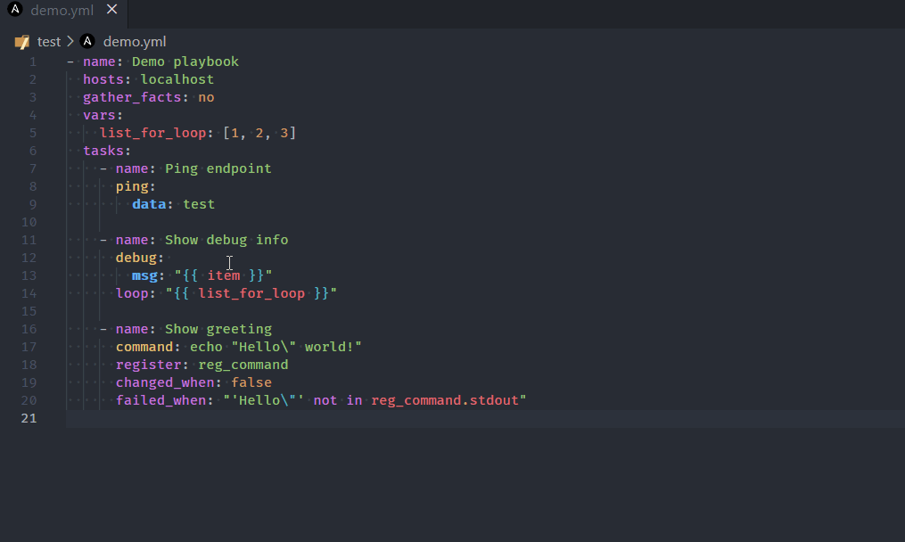

# Ansible VS Code Extension by Red Hat

This extension adds language support for Ansible to
[Visual Studio Code](https://marketplace.visualstudio.com/items?itemName=redhat.ansible)
and [OpenVSX](https://open-vsx.org/extension/redhat/ansible) compatible editors
by leveraging
[ansible-language-server](https://github.com/ansible/ansible-language-server).

## Language association to yaml files

The extension works only when a document is assigned `ansible` language. The
following method is used to assign `ansible` language to the document opened by
the extension:

### Without file inspection

- yaml files under `/playbooks` dir.
- files with the following double extension: `.ansible.yml` or `.ansible.yaml`.
- notable yaml names recognized by ansible like `site.yml` or `site.yaml`
- yaml files having playbook in their filename: `*playbook*.yml` or
  `*playbook*.yaml`

Additionally, in vscode, you can add persistent file association for language to
`settings.json` file like this:

```json
{
  ...

  "files.associations": {
    "*plays.yml": "ansible",
    "*init.yml": "yaml",
  }
}
```

### With file inspection

#### File inspection for ansible keywords

- Primary method is inspection for top level playbook keywords like hosts and
  import_playbook in yaml files.

#### Modelines (optional)

- The extension also supports the usage of
  [modelines](https://vim.fandom.com/wiki/Modeline_magic) and when used, it is
  given highest priority and language is set according to modelines. Example and
  syntax of modelines:

```yaml
# code: language=ansible
or
# code: language=yaml
```

Rest all the .yml, or .yaml files will remain yaml by default unless the user
explicitly changes the language to ansible for which the process is mentioned
below.

## Activating Red Hat Ansible extension manually

It is recommended to open a folder containing Ansible files with a VS Code
workspace.


Note:

- For Ansible files open in an editor window ensure the language mode is set to
  `Ansible` (bottom right of VS Code window).
- The runtime status of extension should be in activate state. It can be
  verified in the `Extension` window `Runtime Status` tab for `Ansible`
  extension.

## Features

### Syntax highlighting


**Ansible keywords**, **module names** and **module options**, as well as
standard YAML elements are recognized and highlighted distinctly. Jinja
expressions are supported too, also those in Ansible conditionals (`when`,
`failed_when`, `changed_when`, `check_mode`), which are not placed in double
curly braces.

> The screenshots and animations presented in this README have been taken using
> the One Dark Pro theme. The default VS Code theme will not show the syntax
> elements as distinctly, unless customized. Virtually any theme other than
> default will do better.

### Validation


While you type, the syntax of your Ansible scripts is verified and any feedback
is provided instantaneously.

#### Integration with ansible-lint


On opening and saving a document, `ansible-lint` is executed in the background
and any findings are presented as errors. You might find it useful that
rules/tags added to `warn_list` (see
[Ansible Lint Documentation](https://ansible.readthedocs.io/projects/lint/configuring/))
are shown as warnings instead.

### Smart autocompletion


The extension tries to detect whether the cursor is on a play, block or task
etc. and provides suggestions accordingly. There are also a few other rules that
improve user experience:

- the `name` property is always suggested first
- on module options, the required properties are shown first, and aliases are
  shown last, otherwise ordering from the documentation is preserved
- FQCNs (fully qualified collection names) are inserted only when necessary;
  collections configured with the
  [`collections` keyword](<[LINK](https://docs.ansible.com/ansible/latest/user_guide/collections_using.html#simplifying-module-names-with-the-collections-keyword)>)
  are honored. This behavior can be disabled in extension settings.

#### Auto-closing Jinja expressions


When writing a Jinja expression, you only need to type `"{{`, and it will be
mirrored behind the cursor (including the space). You can also select the whole
expression and press `space` to put spaces on both sides of the expression.

### Documentation reference


Documentation is available on hover for Ansible keywords, modules and module
options. The extension works on the same principle as `ansible-doc`, providing
the documentation straight from the Python implementation of the modules.

#### Jump to module code



You may also open the implementation of any module using the standard _Go to
Definition_ operation, for instance, by clicking on the module name while
holding `ctrl`/`cmd`.

### Ansible Lightspeed with Watson Code Assistant

AI based Ansible code recommendations

- [Getting started](https://docs.ai.ansible.redhat.com/vscode_guide/installing_vs/#configuring-the-ansible-vs-code-extension)

- [Contact](https://matrix.to/#/%23ansible-lightspeed:ansible.im)

## Requirements

- [Ansible 2.9+](https://docs.ansible.com/ansible/latest/index.html)
- [Ansible Lint](https://ansible-lint.readthedocs.io/en/latest/) (required,
  unless you disable linter support; install without `yamllint`)

For Windows users, this extension works perfectly well with extensions such as
`Remote - WSL` and `Remote - Containers`.

> If you have any other extension providing language support for Ansible, you
> might need to uninstall it first.

## Configuration

This extension supports multi-root workspaces, and as such, can be configured on
any level (User, Remote, Workspace and/or Folder).

- `ansible.ansible.path`: Path to the `ansible` executable.
- `ansible.ansible.reuseTerminal`: Enabling this will cause ansible commands run
  through VSCode to reuse the same Ansible Terminal.
- `ansible.ansible.useFullyQualifiedCollectionNames`: Toggles use of fully
  qualified collection names (FQCN) when inserting a module name. Disabling it
  will only use FQCNs when necessary, that is when the collection isn't
  configured for the task.
- `ansible.ansibleLint.arguments`: Optional command line arguments to be
  appended to `ansible-lint` invocation. See `ansible-lint` documentation.
- `ansible.ansibleLint.enabled`: Enables/disables use of `ansible-lint`.
- `ansible.ansibleLint.path`: Path to the `ansible-lint` executable.
- `ansible.ansibleNavigator.path`: Path to the `ansible-navigator` executable.
- `ansible.executionEnvironment.containerEngine`: The container engine to be
  used while running with execution environment. Valid values are `auto`,
  `podman` and `docker`. For `auto` it will look for `podman` then `docker`.
- `ansible.executionEnvironment.containerOptions`: Extra parameters passed to
  the container engine command example: `--net=host`
- `ansible.executionEnvironment.enabled`: Enable or disable the use of an
  execution environment.
- `ansible.executionEnvironment.image`: Specify the name of the execution
  environment image.
- `ansible.executionEnvironment.pull.arguments`: Specify any additional
  parameters that should be added to the pull command when pulling an execution
  environment from a container registry. e.g. `--tls-verify=false`
- `ansible.executionEnvironment.pull.policy`: Specify the image pull policy.
  Valid values are `always`, `missing`, `never` and `tag`. Setting `always` will
  always pull the image when extension is activated or reloaded. Setting
  `missing` will pull if not locally available. Setting `never` will never pull
  the image and setting tag will always pull if the image tag is 'latest',
  otherwise pull if not locally available.
- `ansible.executionEnvironment.volumeMounts`: The setting contains volume mount
  information for each entry in the list. Individual entry consist of a
  - `src`: The name of the local volume or path to be mounted within execution
    environment.
  - `dest`: The path where the file or directory are mounted in the container.
  - `options`: The field is optional, and is a comma-separated list of options,
    such as `ro,Z`
- `ansible.python.interpreterPath`: Path to the `python`/`python3` executable.
  This setting may be used to make the extension work with `ansible` and
  `ansible-lint` installations in a Python virtual environment.
- `ansible.python.activationScript`: Path to a custom `activate` script, which
  will be used instead of the setting above to run in a Python virtual
  environment.
- `ansible.completion.provideRedirectModules`: Toggle redirected module provider
  when completing modules.
- `ansible.completion.provideModuleOptionAliases`: Toggle alias provider when
  completing module options.
- `ansibleServer.trace.server`: Traces the communication between VSCode and the
  ansible language server.
- `ansible.lightspeed.enabled`: Enable Ansible Lightspeed.
- `ansible.lightspeed.URL`: URL for Ansible Lightspeed.
- `ansible.lightspeed.suggestions.enabled`: Enable Ansible Lightspeed with
  Watson Code Assistant inline suggestions.

## Data and Telemetry

The `vscode-ansible` extension collects anonymous [usage data](USAGE_DATA.md)
and sends it to Red Hat servers to help improve our products and services. Read
our
[privacy statement](https://developers.redhat.com/article/tool-data-collection)
to learn more. This extension respects the `redhat.telemetry.enabled` setting,
which you can learn more about at
<https://github.com/redhat-developer/vscode-redhat-telemetry#how-to-disable-telemetry-reporting>

## Known limitations

- The shorthand syntax for module options (key=value pairs) is not supported.
- Nested module options are not supported yet.
- Only Jinja _expressions_ inside Ansible YAML files are supported. In order to
  have syntax highlighting of Jinja template files, you'll need to install other
  extension.
- Jinja _blocks_ (inside Ansible YAML files) are not supported yet.

## Contact

- [Ansible Developer Tools matrix channel](https://matrix.to/#/#devtools:ansible.im)

## Credit

Based on the good work done by
[Tomasz Maciążek](https://github.com/tomaciazek/vscode-ansible)
