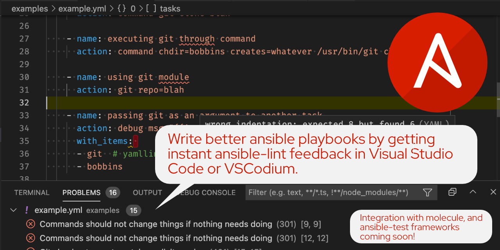

# vscode-ansible README

Ansible extension aims to ease life of Ansible content creators by making
easier to write Ansible playbooks, roles, collections, modules and plugins.

This extension is at its early stage and at this moment it does only run
ansible-lint and presents its results on file save.

## Features

## Requirements

This extension also installs YAML extension.

## Known Issues

Calling out known issues can help limit users opening duplicate issues against your extension.

## Release Notes

Users appreciate release notes as you update your extension.

### 0.0.2

* Run ansible-lint on save and report problems.
