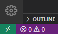
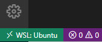

# For Windows users

## WSL is needed

Basically, Ansible Lint and Ansible are not compatible with Windows. So you need to use WSL (Windows Subsystem for Linux) to make them work on Windows.

## Enable WSL

For those who haven't installed WSL, follow the instruction [here](https://docs.microsoft.com/en-us/windows/wsl/install-win10#manual-installation-steps). **You should only do Step 1, restart your Windows machine, and do Step 6**, because WSL 2 is [buggy](https://github.com/microsoft/WSL/issues/4784) for now as of April 2021, and you will only need WSL 1.

In this example, Ubuntu is taken in Step 6.

## Install Windows Terminal (optional)

You can install Windows Terminal [here](https://docs.microsoft.com/en-us/windows/terminal/get-started). In most cases, installing from [Microsoft Store](https://aka.ms/terminal) is easy.

## Add PATH directory in WSL Linux

Execute the following command to create a directory in WSL Linux.

```sh
mkdir -p ~/.local/bin
```

Then add the following lines to `~/.profile`, which are copied from `/etc/skel/.profile`.

```sh
if [ -d "$HOME/.local/bin" ] ; then
    PATH="$HOME/.local/bin:$PATH"
fi
```

Log out and Log in again to set PATH. Then verify that `~/.local/bin` is added to PATH with the following command.

```sh
echo $PATH
# /root/.local/bin:/usr/local/sbin:...
```

## Set up VS Code

Get back to the Windows machine and launch VS Code.

Install [Remote - WSL](https://marketplace.visualstudio.com/items?itemName=ms-vscode-remote.remote-wsl) to enable VS Code on Windows to run Linux program directly, so that Ansible Lint is available on Windows through WSL.

Then you will find the green area like the picture below in the bottom left corner of the VS Code window.



Click on this green area, select "Remote-WSL: New Window using Distro...", and select the distribution you installed. After that, a new VS Code window opens and you will find the green area in the bottom left corner saids "WSL: xxxx" to indicate that now you are in WSL.



**Inside the VS Code window that is connected to WSL,** install [YAML](https://marketplace.visualstudio.com/items?itemName=redhat.vscode-yaml), and [Ansible Language](https://marketplace.visualstudio.com/items?itemName=zbr.vscode-ansible) extensions.

Now Windows-specific setup procedure is done! Then plain procedure for Linux follows.

## Make Ansible Lint available from VS Code

Get back into WSL, and follow the instruction for [Linux](linux.md).

After that, you should see Ansible Language is fully functioning with Ansible Lint and YAMLLint, without installing them system-wide.
