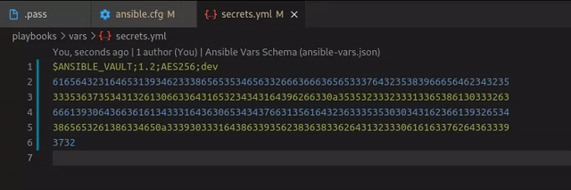
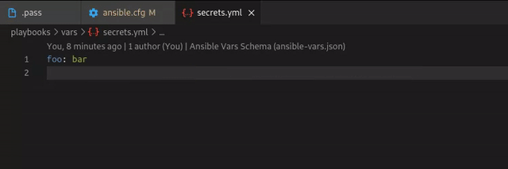
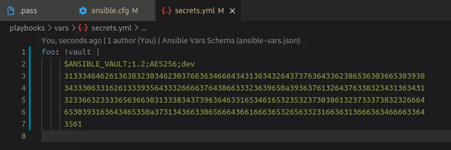

# How to edit vaults

## Background: No need to install Ansible system-wide

To make Ansible Language Extension fully function, users needs to have `ansible-vault` provided by Ansible package. The easiest way to install Ansible is to install it system-wide as below:

```sh
# Fedora
sudo dnf install ansible

# Ubuntu
sudo apt install ansible
```

However, installing Ansible system-wide is not always preferable because you cannot choose a specific version for a particuliar project. You can install Ansible via `pip` inside you home directory, and integrate it with Ansible Language Extension instead.

## How to install Ansible via `pip`

> Windows installation of `pip` is not documented here but take a look at [How to install WSL and configuring VSCode to use it](../integrate_ansible-lint_in_venv/windows.md) and follow the Linux instructions to install Python and Ansible.

1. Install `pip`

```sh
# Fedora
sudo dnf install python-pip

# Ubuntu
sudo apt install python3-pip
```

2. Install Ansible package via `pip`.

```sh
pip install --user ansible

# Or for a specific version :
pip install --user ansible==2.9.6
```

## Vaults Editing

> Please read [Managing multiple passwords with vault IDs](https://docs.ansible.com/ansible/latest/user_guide/vault.html#managing-multiple-passwords-with-vault-ids) before

Specify your vault passwords with `vault_identity_list` in your `ansible.cfg` at your project root or in your [`ANSIBLE_VAULT_IDENTITY_LIST`](https://docs.ansible.com/ansible/latest/reference_appendices/config.html#envvar-ANSIBLE_VAULT_IDENTITY_LIST) environment variable and choose the one you want to use when prompted :
  * `[Ctrl+Alt+0]` for Linux and Windows
  * `[Cmd+Alt+0]` for Mac

### Full file vault

For encrypting :

1. Create a secret file for storing your password
2. Configure your `vault_identity_list` in your `ansible.cfg` file by associating a Vault ID to your secret file path
3. Open the file you want to encrypt
4. Press the magic keyboard shortcut
5. Et voilà ! :wink:


For decrypting, same step as above. You just have to open your encrypted file and press the shortcut :



Vault ID is automatically detected on the first line of the vault and will be used for decrypting.

### Inline vault

Mainly the same thing than for full file vaults. After opening your plain text file, just select the value you want to be encrypted and press the shortcut :



For decrypting you need to select the encrypted text and press the shortcut :


