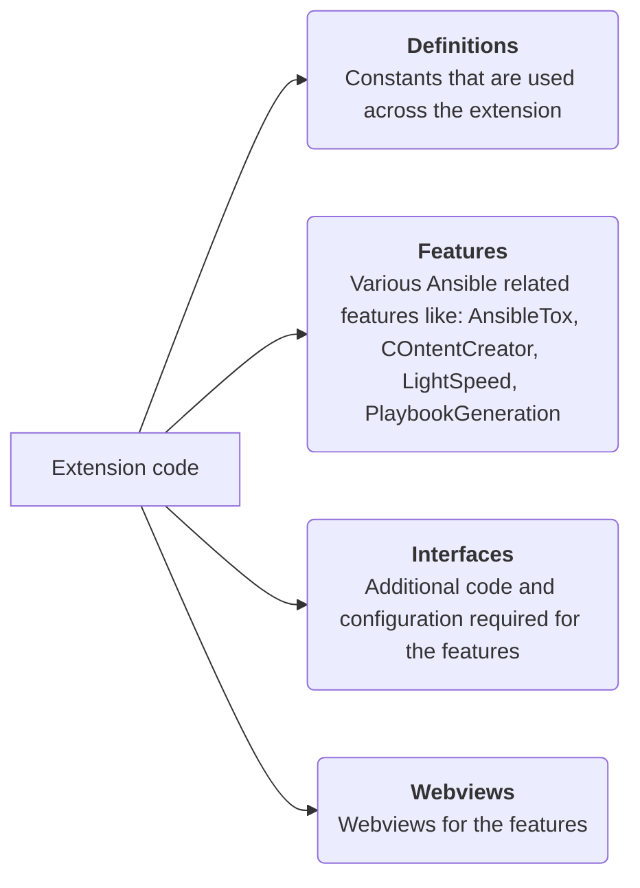

# Extension code structure

The diagram below shows how the extension code is organized within the project:

!!! note

    The diagram does not include:
    - `extension.ts` file - This the entry point is always at the root of `src` folder (Refer to the project structure).
    - `test` files - Tests are organized differently and are explained later (Refer to test structure).

The extension code is divided into 4 parts and the explanation is mentioned
below.

## Definitions

All constants such as global names, keywords, paths, and commands used
throughout the extension are placed in this sub-folder.

## Features

Besides providing language services for Ansible, the extension hosts various
Ansible development tools and features. Implementations of these features are in
this sub-folder.

## Interfaces

Different types and configurations used across the extension for various
features are in this sub-folder.

## Webviews

A lot of Ansible developer tools are implemented as web-views in the extension.
The web-view files for these features are in this sub-folder.
