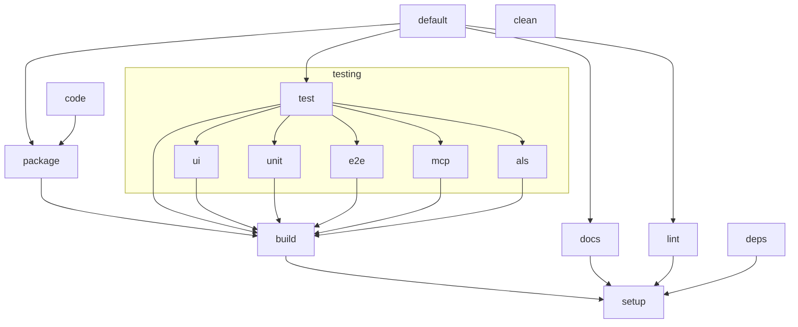

# Developing and debugging guide for the VS Code Ansible extension

This guide provides information on getting started, understanding the project,
and developing the extension. It also includes additional resources for VS Code
Extension development.

## Build tasks

To ease local development and testing, we use
[taskfile.dev](https://taskfile.dev/) but you can also call yarn directly for
most commands if you want.

To see all the commands available, run `task -l` and it will list all of them
along with their descriptions.

```console exec="1" source="console"
$ task -l
```

The diagram below shows the dependencies between the command task commands.



## Release and publication of extension

Github Actions pipeline has two publishing jobs, one for marketplace publishing
and another one of publishing ansible-language-server to npm registry. Both of
these require manual approval from one of the core maintainers.

Admin interface for
[VS Code Marketplace](https://marketplace.visualstudio.com/manage/publishers/redhat).
