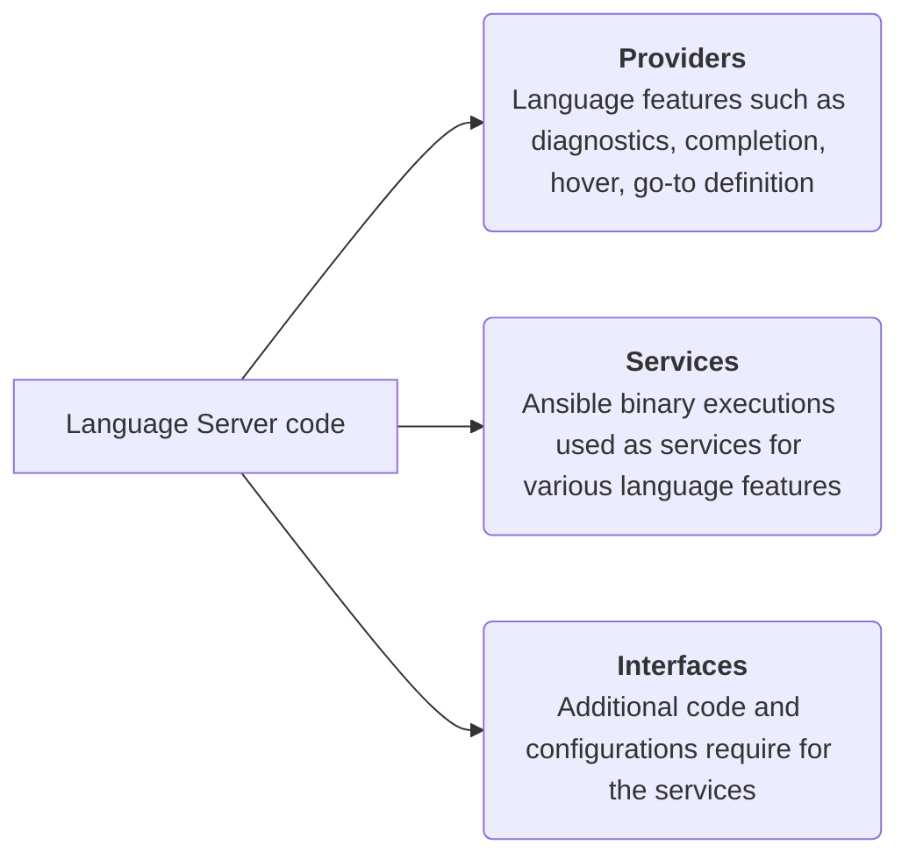

# Language server code structure

The diagram below shows how the server code is organized within the project:

!!! note

    The diagram does not include:
    - `server.ts` file - This the entry point is always at the root of `src` folder (Refer to the project structure).
    - `test` files - Tests are organized differently and are explained later (Refer to test structure).

The server code is divided into 3 parts and the explanation is mentioned below.

## Providers

The implementation of all the language features for Ansible, such as semantics,
auto-completion, validation, hover, and go-to definition, are in this
sub-folder.

## Services

The language features use various Ansible binaries behind the scenes.
Implementations and runners for these binaries are located in this sub-folder.

## Interfaces

This sub-folder contains types and configurations used for different features
across the extension.
