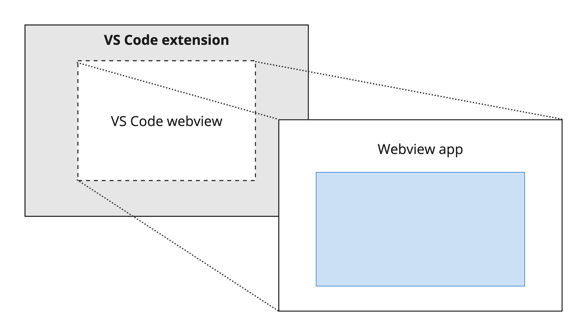
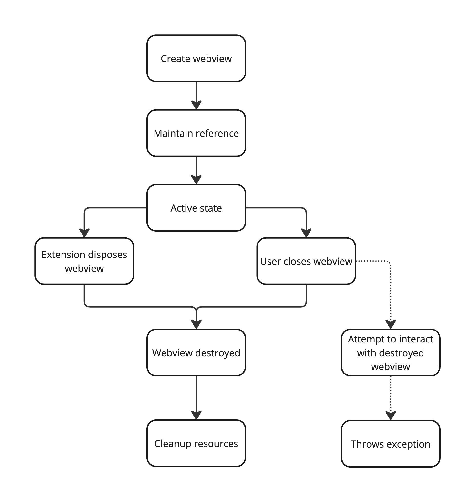
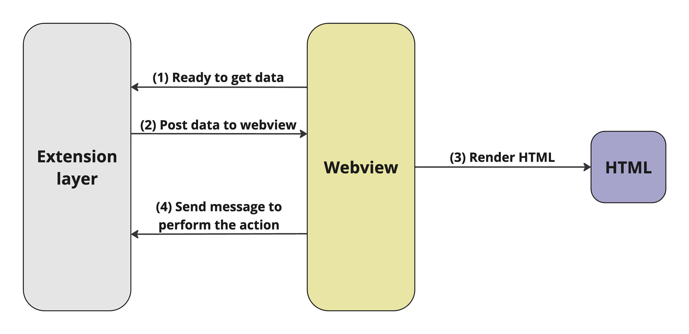

# Chapter 6: Developing webview in extension

## Overview



The Webview API allows extensions to create fully customizable views within the
VS Code extension. You can use Webviews to build complex user interfaces beyond
the capabilities of VS Code's native APIs .

Think of a Webview as an iframe within VS Code that your extension controls. A
Webview can render almost any HTML content in this frame and communicates with
extensions using message passing.

## Webview Lifecycle

Webview panels are owned by the extension that creates them. The following
flowchart explains the lifecycle of a webview.



## Implementation steps

This guide outlines the steps to create and implement a Webview in the
vscode-ansible extension. This might differ from the implementation for other
extensions.

### Step 1: Contribute a command

Define a command in the `package.json` for the extension. Implement this command
in the extension code to register and trigger the Webview.

```json
"commands": [
      {
        "command": "myWebview.start",
        "title": "Start a new webview",
        "category": "Custom webviews"
      }
    ]
```

### Step 2: Create a Webview panel

In the extension code, use Use the `vscode.window.createWebviewPanel` function
to instantiate and render a Webview panel within the editor.

```typescript
context.subscriptions.push(
  vscode.commands.registerCommand("myWebview.start", () => {
    // Create and show a new webview
    const panel = vscode.window.createWebviewPanel(
      "webview-id", // Identifies the type of the webview. Used internally
      "Webview Title", // Title of the panel displayed to the user
      vscode.ViewColumn.One, // Editor column to show the new webview panel in.
      {}, // Webview options. More on these later.
    );
  }),
);
```

### Step 3: Structure the code

To organize the code, create two separate files:

1.  **Extension file (`<webview-name>Page.ts`):** This file hosts the webview.
    In this file you should:

    - Define a class with methods to render, dispose, and manage the Webview
      lifecycle.

    - Create a method to return the HTML content for the Webview.

    - Link to the Webview file and access VSCode elements like commands and
      settings.

    - Access the vscode and workspace elements such as commands and settings and
      manipulate them.

2.  **Webview file: (`<webview-name>PageApp.ts`):** This file manages the
    Webview content. In this file you should:

    - Interact with DOM elements within the HTML.

    - Add event listeners and manipulate HTML elements, excluding vscode and
      workspace elements.

!!! tip

    You can set up communication between the extension and the webview. This is covered in the further section.

### Step 4: Configure webpack

Set up the Webpack configuration to bundle your extension and Webview assets in
the `webpack.config.ts` file.

### Step 5: Build and debug

Build the extension using the command `yarn run webpack-dev` and run the
extension in debug mode using the configuration `Launch extension`. Make changes
in the code and reload the extension host window to see the live implementation.

## Debugging the Webviews

VS Code is built with Electron and includes Chrome's built-in browser and
DevTools. This setup allows debugging both VS Code and Webviews. Follow the
steps below to debug a Webview in VS Code:

1. Compile and start by running your VS Code extension in debug mode (refer Step
   5 of Implementation steps).

2. Navigate to and open the Webview you wish to debug within the editor.

3. Press `Ctrl + Shift + P` (Windows/Linux) or `Cmd + Shift + P` (Mac) to bring
   up the Command Palette.

4. Search for the command `Open Webview Developer Tools` and select it.

After these steps are completed, an instance of DevTools will open in a separate
window. You can use this instance to do the following:

- Select and inspect the HTML elements within the Webview.

- Tweak CSS styles directly to see live changes.

- Add breakpoints and debug JavaScript code, similar to debugging a standard
  webpage.

## Communication between the webview panel and the extension



### Passing message from the extension context to the webview context

The extension can send data to its webviews using `webview.postMessage()`. This
method sends any JSON serializable data to the webview. The message is received
inside the webview through the standard message event.

extension context code:

```typescript
// Send a message to our webview.
// You can send any JSON serializable data.
currentPanel.webview.postMessage({ command: "refactor" });
```

webview context code:

```typescript
// Handle the message inside the webview
window.addEventListener("message", (event) => {
  const message = event.data; // The JSON data our extension sent

  switch (message.command) {
    case "refactor":
      count = Math.ceil(count * 0.5);
      counter.textContent = count;
      break;
  }
});
```

### Passing a message from the webview context to the extension context

Webviews can pass messages back to their extension. This is accomplished using
`postMessage()` on a special VS Code API object inside the webview. To access
the VS Code API object, call `acquireVsCodeApi()` inside the webview. This
function can only be invoked once per session. You must hang onto the instance
of the VS Code API returned by this method, and hand it out to any other
functions that need to use it.

webview context code:

```typescript
// Access the vscode API object and post message
const vscode = acquireVsCodeApi();
vscode.postMessage({
  command: "alert",
  text: "Hello, world!",
});
```

extension context code:

```typescript
// Handle messages from the webview
panel.webview.onDidReceiveMessage(
  (message) => {
    switch (message.command) {
      case "alert":
        vscode.window.showErrorMessage(message.text);
        return;
    }
  },
  undefined,
  context.subscriptions,
);
```

## Resources

1.  **Local resources:** The extension has already implemented some webviews.
    You can see them in the following locations:

    - extension context file:
      [createAnsibleProjectPage.ts](https://github.com/ansible/vscode-ansible/blob/main/src/features/contentCreator/createAnsibleProjectPage.ts)

    - webview context file:
      [createAnsibleProjectPageApp.ts](https://github.com/ansible/vscode-ansible/blob/main/src/webview/apps/contentCreator/createAnsibleProjectPageApp.ts)

    - webpack config file:
      [webpack.config.ts](https://github.com/ansible/vscode-ansible/blob/main/webpack.config.ts)

2.  **External resources:** The best explanation of implementing a webview is
    described by Microsoft. You can look at these:

    - [Microsoft’s guide for the Webview API](https://code.visualstudio.com/api/extension-guides/webview)

    - [Microsoft’s UX guidelines for webviews](https://code.visualstudio.com/api/ux-guidelines/webviews)

    - [Microsoft's webview sample extension](https://github.com/microsoft/vscode-extension-samples/blob/main/webview-sample/README.md)

    - [VS Code webview UI toolkit](https://github.com/microsoft/vscode-webview-ui-toolkit)
