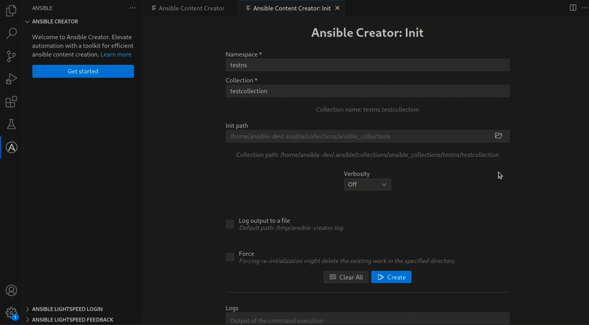
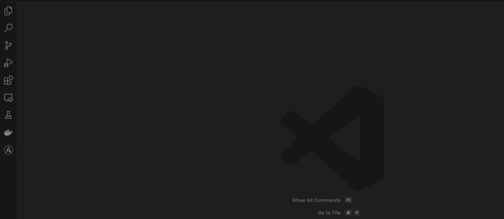

<!-- markdownlint-disable MD033 MD041 MD013-->

<figure align="center">
  
  <figcaption>Scaffolding a collection using Ansible creator inside the Ansible extension</figcaption>
</figure>
 
<figure align="center">
  
  <figcaption>Ansible navigator's menu options</figcaption>
</figure>
 
<a href="https://www.youtube.com/watch?v=_aEX3HkjayI">
  <figure align="center">
    
    <figcaption>Red Hat Ansible Automation Platform automation hub overview</figcaption>
  </figure>
</a>
 
<figure align="center">
  
  <figcaption>Ansible Lightspeed's in-code functionality</figcaption>
</figure>
 
<figure align="center">
  
  <figcaption>Generate playbooks with Ansible Lightspeed inside the Ansible extension</figcaption>
</figure>
 
