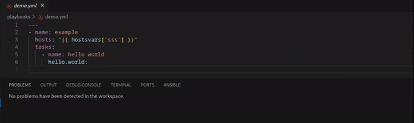
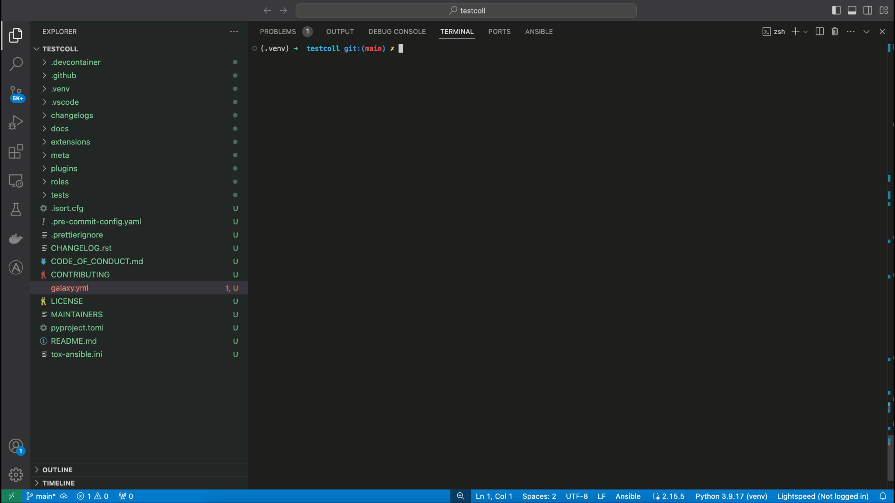
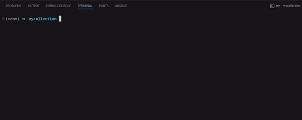

<!-- markdownlint-disable MD033 MD041 MD013-->

<figure align="center">
  
  <figcaption>Ansible lint integration inside the Ansible extension</figcaption>
</figure>
 
<figure align="center">
  
  <figcaption>Molecule's test scenario options and how to run a scenario</figcaption>
</figure>
 
<figure align="center">
  
  <figcaption>Using pytest Ansible with VSCode's Test Explorer</figcaption>
</figure>
 
<figure align="center">
  
  <figcaption>Displaying tox Ansible options and running a test suite</figcaption>
</figure>
 
