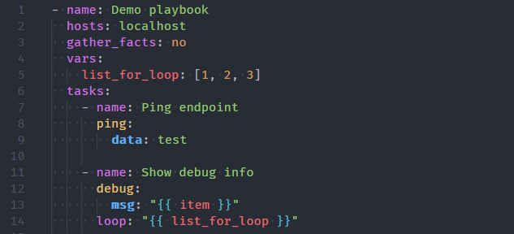
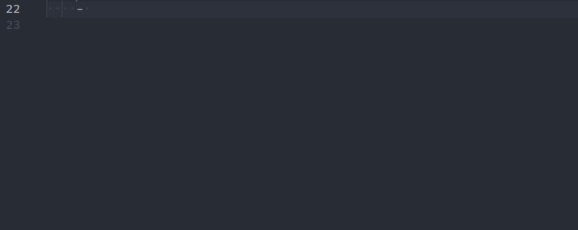
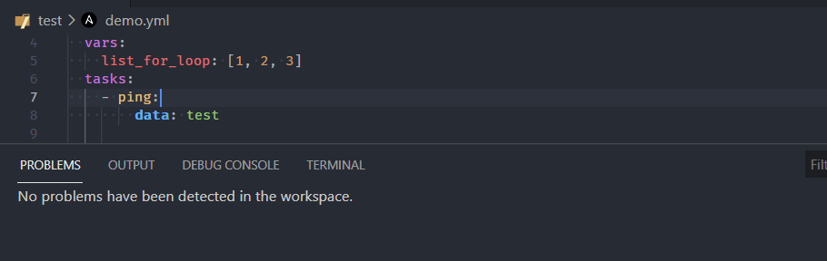
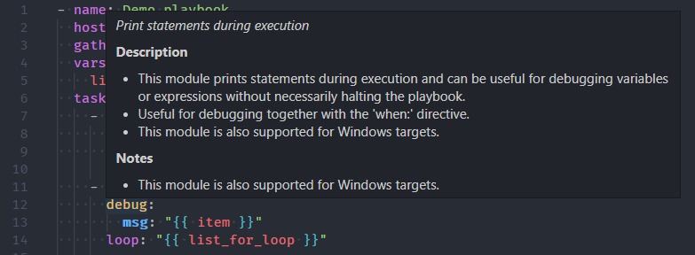
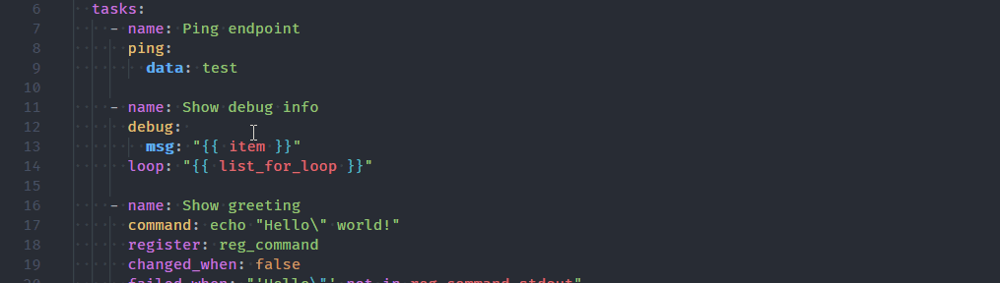

<!-- markdownlint-disable MD033 MD041 MD013-->

<figure align="center">
  
  <figcaption>Syntax Highlighting</figcaption>
</figure>

<figure align="center">
  
  <figcaption>Auto Completion</figcaption>
</figure>

<figure align="center">
  
  <figcaption>Code Validation</figcaption>
</figure>

<figure align="center">
  
  <figcaption>Hover Documentation</figcaption>
</figure>

<figure align="center">
  
  <figcaption>Go To Definition</figcaption>
</figure>
